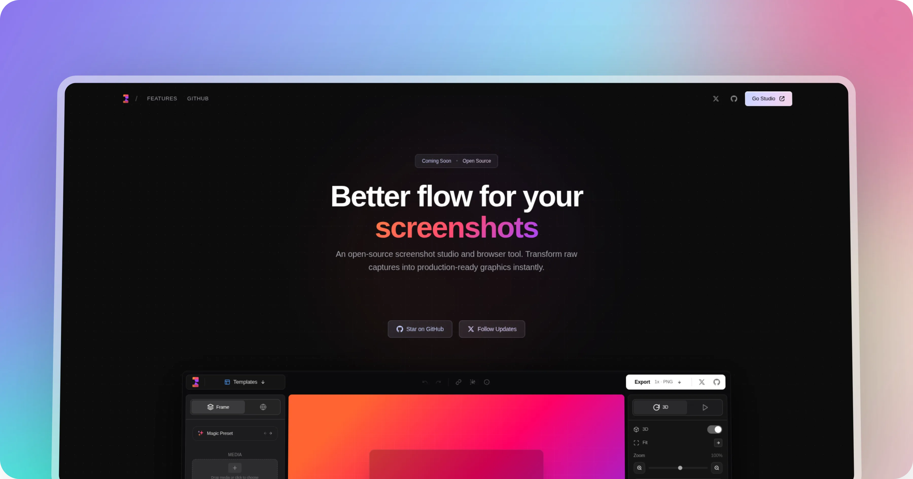

  

# Better Flow

> An open-source screenshot studio and browser tool. Transform raw captures into production-ready graphics instantly.

<!-- TODO: Add project screenshot here when available -->
<!-- 

  

 -->

  
  
  
  

---

## Overview

**Better Flow** is a landing page and coming-soon site for an upcoming open-source screenshot beautification tool. The site showcases the product's features, tech stack, and roadmap while maintaining a premium, dark-themed aesthetic.

## What is Better Flow?

Better Flow is an upcoming open-source tool that turns raw screenshots into polished, production-ready visuals. Think of it as a screenshot studio inside your browser — no uploads, no servers, no data leaving your machine.

## Features

- **Screenshot Studio** — One-click transformations with browser mockups, device frames, and 3D effects
- **Visual Effects** — Add glow, particles, spotlight, and tilt to make captures stand out
- **Export Any Format** — PNG, MP4, GIF — whatever your content needs
- **Local Processing** — Everything happens in your browser. No server uploads, no cloud dependencies
- **Open Source** — Apache 2.0 License. Use it, modify it, ship it

## Tech Stack

| Technology | Role |
|------------|------|
| [React](https://react.dev) | UI Framework |
| [Next.js](https://nextjs.org) | App Framework |
| [Tailwind CSS](https://tailwindcss.com) | Styling Engine |
| [shadcn/ui](https://ui.shadcn.com) | Component Library |

## Privacy & Open Source

- **Zero Telemetry** — No tracking pixels, no analytics cookies, no usage data collection
- **Local-First** — All image processing happens directly in your browser
- **Community Driven** — Transparent roadmap and open for contributions
- **Auditable Code** — Every line is public. No hidden tracking, no proprietary black boxes

## Roadmap

| Version | Status | Milestone |
|---------|--------|-----------|
| v0.1 | DONE | Landing Page |
| v0.2 | SOON | Studio Launch — Editor, browser frames, device mockups |
| v0.3 | LATER | Export & Video — PNG/WebP, 4K, MP4/GIF |
| v0.4 | LATER | Chrome Extension — One-click capture & quick export |
| v0.5 | LATER | Social Integrations — Direct publishing to Twitter/X, LinkedIn |

## License

[Apache 2.0](LICENSE) — Commercial use fully permitted.

---

Built with modern open-source technologies. TypeScript-first, locally processed, no telemetry.
